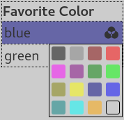

#  Character Chart

The Character Chart is one of the most powerful organizational tools in
openworldfactory. It is like a mini spreadsheet in your project that keeps track
of statistics about each character. You can access the chart from the bottom of
the project overview.

## Character Sheets

To start adding information to your chart, you will need at least one character.
Go to their Character Sheet tab and enter Edit Mode. Click the Add Property
button, which will bring up a window to enter a new property.

In this window, add a name and a value for the new property. For example, if you
want to record that Mary Sue's favorite color is green, you would type "Favorite
Color" in "Name" and "green" in "value." Remember that every time you use a
property name, it must be spelled and capitalized the same way.

Click "Add" to finish adding the new property. It should now show up in the
character sheet.

## The Character Chart

Each character has a Character Sheet tab that shows all their properties.
However, there is also a Character Chart page near the bottom of your project
overview that collects all your character charts into one place. Characters are
listed as rows sorted in alphabetical order, and properties are listed as
columns sorted by frequency of use.

You can edit any property in the chart, just like in a spreadsheet, in Edit
Mode.

## Color Coding

To color code a value, enter Edit Mode and hover over a cell with the value you
would like to color. Choose a color from the dropdown menu that appears at the
right of the cell. Now that value will be that color anywhere it occurs for that
property. For example, if you had a "Has Magical Powers?" property, you could
color-code "Yes" as green and "No" as red.

