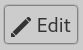

#  Editing

To enter Edit Mode, click the Edit button in the top right corner:

Edit Mode allows you to add notes, attachments, and other details to the items
in your project. You can also rename objects using the Name field at the top:

To save the changes you've made, click the Save button, also in the top right
corner:

If you forget to save changes, OpenWorldFactory will attempt to recover your
progress when you reopen the project. However, it may fail for a variety of
reasons, so it's better to save your progress before you exit.
