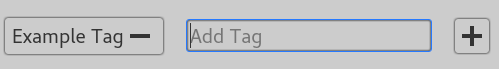
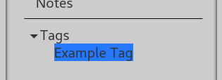

#  Tags

Tags make it easy to organize and group items in your project.

To tag a page, enter Edit Mode and type the tag into the "Add Tag" box, shown
below. Make sure that you type it the same way each time (with the same
capitalization and spelling).

Each tag has its own page that is created the first time you use it. These are
filed under "Tags," underneath the divider in your project overview.

Tag pages list every item with that tag. You can also add notes and attachments,
just like any other page.
