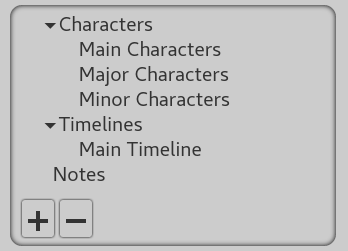
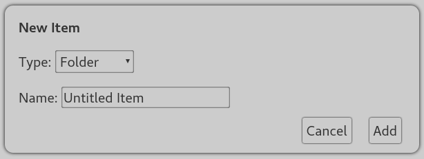

#  Project Structure

Each project has a tree structure, similar to the Documents folder on your
computer. This allows you to organize your notes on your world in whatever way
you like.

Every new project has some default folders and notes to get you started.

Above is the project overview. It shows you the folders and notes in your
project. To expand or collapse a folder, click the arrow next to it. If you're
using the mobile app, you can access this using the button in the top left
corner. On desktop, it is permanently shown on the left of the screen.

To add an item, press the "plus" button at the bottom of the project overview.
You will get a window that looks like this:

Choose the type of item by clicking the dropdown box, then choose a name for the
item. Click "Add" to add the item to the currently selected folder.

To remove an item, simply select it and then click the "minus" button at the
bottom of the project overview.

## Types of Items

OpenWorldFactory provides several types of notes for organizing different
information about your world.

- [Notes and Characters](folders_notes_and_characters.md)
- [Timelines and Events](timelines_and_events.md)
