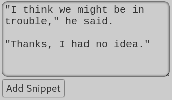

#  Snippets

Snippets are great for keeping a few lines of text to use later. The Snippets
page is at the bottom of the project overview.

To add a new snippet, go to the page and click Edit. A text box will appear at
the top to enter your text. Make sure you click "Add Snippet" when you're done.

All your snippets will appear below, newest on top. Clicking any snippet will
copy it to your clipboard so you can paste it elsewhere.

If you want to delete a snippet, you must be in Edit Mode. Then, click the trash
can button in the upper right-hand corner of the snippet. Deleted snippets will
be moved to the Trash tab, where you can either restore them or delete them
permanently.
