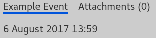
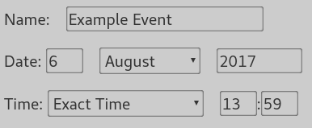
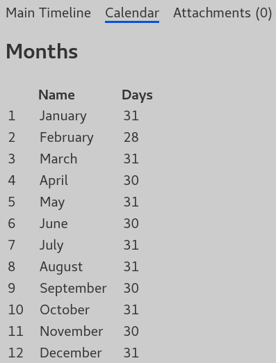

#  Timelines and Events

Timelines are a special type of folder that can store notes on events
chronologically. To add an event to a timeline, click the "plus" button at the
bottom of the project overview, the same way you would create any other note.

## Event Editor
Every event has a date and time associated with it. This is shown at the top of
the event's page:

In [Edit Mode](./editing.md), you can edit the date and time:

Use the fields given to edit the day, month, and year.

### Time Editor

Below the date fields are the time fields. The dropdown box allows you to choose between All Day, Exact Time, or a time of day. An event set to Exact Time has an hour and a minute, specified in 24-hour time for simplicity.

All Day removes the time altogether; use this for events that don't take place at a certain time, like birthdays or holidays.

The other options in the dropdown specify the time of day:

- After Midnight
- Sunrise
- Early Morning
- Late Morning
- Noon
- Early Afternoon
- Late Afternoon
- Evening
- Sunset
- After Sunset
- Before Midnight
- Midnight

If you choose one of these, it will be displayed in place of the hour and minute, like this:

## Calendars
Timelines have an extra tab at the top called Calendar. Here, you can edit the names of the months as well as the number of days in each. This allows timelines to accommodate many alternate calendars that might appear in fantasy worlds. By default, it is set to a normal Gregorian calendar, with no leap days.

